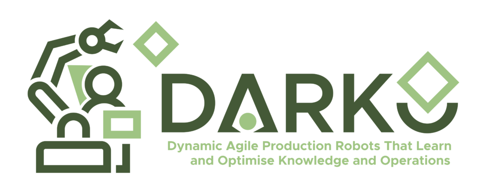

# Thunder - [thunder_dynamics](https://github.com/CentroEPiaggio/thunder_dynamics) - v0.9.19 - legacy


## Experimental plugin-based infrastructure

Thunder is now built using a plugin-based infrastructure.
This implementation works with the older yaml structure.

Example config file, for a RR

```yaml
pipeline:
  loaders: ["legacy_loader"]
  builders: ["legacy_builder"]
  generators: ["legacy_generator"]


#########################
legacy_generator:
  gen_casadi: True
  python: True

#########################
legacy_loader:
  robot_name: "test_robot"
  # --- Constants --- #
  PI_2: &PI_2           1.5707963267948966
  PI_2_neg: &PI_2_neg  -1.5707963267948966


   ... old config
```

To see the list of plugin, together with the descriptions:

	thunder plugin list --verbose

The names displayed in this command are the same used in the `pipeline` parameter.


To write a new builder, minimal template:

```CPP

#ifndef MY_BUILDER_H
#define MY_BUILDER_H

#include <yaml-cpp/yaml.h>

#include "../plugin_interfaces.h"
#include "../../library/robot.h"

namespace thunder_ns {


    class MyBuilder : public BaseBuilder {
        public:
        MyBuilder() : BaseBuilder("My custom builder", "My amazing new builder that adds a lot of useful functions.") {}
        
        int configure(const YAML::Node& config) override{
			// CONFIGURE MY STUFF!
            debug_log("Configured", VERB_INFO);
            return 0;
        }

        void build(std::shared_ptr<Robot> robot) override{
            debug_log("Starting my amazing builder", VERB_INFO);
			// COMPUTING MY STUFF!
			//If I want to debug something:			
            debug_log("This info is useful for debug porpose", VERB_DEBUG);
			//robot.add_function("my_stuff");
        }

    };

} // namespace thunder_ns

#endif // MY_BUILDER_H
```


Then include your file and add the plugin to the map in `src/thunder/library/plugin_registry.h`

Done!

---

## Writing plugins in Python

Thunder supports writing plugins in Python. This requires building with Python plugin support enabled:

```bash
cd src/thunder
mkdir -p build && cd build
cmake .. -DBUILD_PYTHON_PLUGINS=ON
make
```

This produces the `thunder_core` Python package (nanobind bindings for `Robot` and utilities, plus pure-Python modules for plugin base classes and pipeline execution) and enables the `py:` prefix in YAML pipeline configurations.

### `thunder_core` package structure

```
thunder_core                  # Python package
├── _bindings                 # Compiled C++ nanobind module (Robot, PluginManager, utils)
├── plugins                   # ABC base classes: BaseLoader, BaseBuilder, BaseGenerator
└── pipeline                  # Config class and run_pipeline() for pipeline execution
```

Everything from `_bindings` is re-exported at the top level, so `thunder_core.Robot`, `thunder_core.PluginManager`, etc. work directly.

### Python plugin conventions

Use the `py:module.ClassName` syntax in the pipeline YAML to reference Python plugins:

```yaml
pipeline:
  loaders:    ["kin_loader", "dyn_loader"]
  builders:   ["kin_builder", "dyn_builder", "py:my_plugins.MyBuilder"]
  generators: ["robot_generator"]

# Config block for the Python plugin (key = full py: name)
"py:my_plugins.MyBuilder":
  my_param: 42
```

Multiple Python plugins of the same type are supported — just add more `py:` entries.

The Python module file (e.g., `my_plugins.py`) should be placed **in the same directory as the YAML config file**. Standard `PYTHONPATH` and `sys.path` rules also apply.

### Writing Python plugins

All Python plugins **must** inherit from the appropriate base class in `thunder_core.plugins`:

| Plugin type | Base class     | Required method      |
|-------------|----------------|----------------------|
| Loader      | `BaseLoader`   | `load(self, robot)`  |
| Builder     | `BaseBuilder`  | `build(self, robot)` |
| Generator   | `BaseGenerator`| `generate(self, robot)` |

These are abstract classes — forgetting to implement the required method will raise a `TypeError` at instantiation.

#### Minimal builder template

```python
import casadi
from thunder_core.plugins import BaseBuilder

class MyBuilder(BaseBuilder):
    def build(self, robot):
        q = robot.get_model("q")            # returns casadi.SX
        expr = casadi.cos(q)                 # standard CasADi Python API
        robot.add_function("cos_q", expr, ["q"], "Cosine of joint angles")
```

#### Optional pydantic config validation

Plugins can optionally define a `ConfigModel` class attribute (a pydantic `BaseModel` subclass) to validate the YAML config dict received in `configure()`. When present, `self.config` will be the validated pydantic model instance instead of a raw dict:

```python
import casadi
from pydantic import BaseModel
from thunder_core.plugins import BaseBuilder

class MyBuilder(BaseBuilder):
    class ConfigModel(BaseModel):
        function_name: str = "cos_q"
        scale: float = 1.0

    def build(self, robot):
        q = robot.get_model("q")
        robot.add_function(
            self.config.function_name,
            self.config.scale * casadi.cos(q),
            ["q"],
            "Scaled cosine of joint angles",
        )
```

If no `ConfigModel` is defined, `self.config` remains a plain Python dict (backward-compatible).

### Running the pipeline from Python

Use `thunder_core.pipeline` to run a pipeline from Python code or Jupyter notebooks:

```python
from thunder_core.pipeline import Config, run_pipeline

# Quick one-liner from a YAML file
robot = run_pipeline("path/to/robot.yaml", robot_name="my_robot")

# Or from a dict
robot = run_pipeline({
    "pipeline": {
        "loaders": ["kin_loader"],
        "builders": ["kin_builder"],
        "generators": []
    },
    "kin_loader": { "num_joints": 2, "joints_type": ["R", "R"] }
}, robot_name="RR")

# Or use Config directly for more control
cfg = Config("path/to/robot.yaml")
print(cfg)
robot = cfg.execute(robot_name="RR", verbose=True)
```

### Available Robot API in Python

```python
import thunder_core

robot = thunder_core.Robot("my_robot")

# Properties (typed getters/setters — C++ templates mapped to explicit methods)
robot.add_property_int("ndof", 3)
robot.add_property_double("mass", 10.5)
robot.add_property_string("name", "arm")
robot.add_property_vector_double("lengths", [1.0, 1.0, 1.0])
ndof  = robot.get_int("ndof")
name  = robot.get_string("name")

# Symbolic variables and parameters (CasADi SX/DM pass seamlessly)
q = casadi.SX.sym("q", 3)
robot.add_variable("q", q, [0.0, 0.0, 0.0], [1, 1, 1])

# Symbolic model access
q_sym = robot.get_model("q")       # returns casadi.SX

# Numeric evaluation
q_val = robot.get_value("q")       # returns casadi.DM

# Set parameter values
robot.set("q", casadi.DM([1.0, 2.0, 3.0]))

# Add symbolic functions
robot.add_function("sin_q", casadi.sin(q), ["q"], "Sine of q")

# I/O
robot.save_par("params.yaml")
robot.load_par("params.yaml")

# Direct map access
print(robot.properties)    # dict-like: {name: Property, ...}
print(robot.parameters)    # dict-like: {name: Parameter, ...}
print(robot.functions)     # dict-like: {name: Function, ...}

# Utility functions
thunder_core.hat(v)        # skew-symmetric matrix
thunder_core.R_x(angle)    # rotation about X
thunder_core.R_y(angle)    # rotation about Y
thunder_core.R_z(angle)    # rotation about Z
```

### Notes on Python plugins

- **CasADi interop**: CasADi's Python objects (`casadi.SX`, `casadi.DM`, `casadi.Function`) are converted automatically at the C++/Python boundary using SWIG pointer extraction. No serialization overhead.
- **Shared Robot object**: Python plugins receive the same `Robot` instance as C++ plugins. Modifications (adding functions, setting parameters) persist across the pipeline.
- **Dynamic attributes**: You can set arbitrary Python attributes on the Robot object (e.g., `robot.my_data = [1,2,3]`). These are visible to subsequent Python plugins but not to C++ plugins. Use `robot.add_property_*()` or `robot.add_parameter()` if C++ needs access.
- **Error handling**: Python exceptions are caught and re-raised as C++ `std::runtime_error` with the full Python traceback.
- **Config**: The YAML config block for a Python plugin is passed to `configure()` as a Python dict (or validated via pydantic if `ConfigModel` is defined). The key in the YAML must match the full `py:module.Class` name.

### Example

See `src/thunder/robots/debug/RRR_py.yaml` and `src/thunder/robots/debug/my_py_builder.py` for a working example.

---


The aim of `thunder_dynamics` is to generate code useful for robot's dynamics and control.

* `thunder`: we implemented some classes in OOP to generalize the approach to serial manipulator control, under the point of view of Denavit-Hartenberg parametrization.
* `thunder_robot`: it is a wrapper class for the generated files. Uses library generated by casadi and provide simple functions for the robot dynamics and adaptive control.
* [old] `genYAML`: we manipulate "original" Franka Emika Panda inertial parameters in `inertial.yaml` to create yaml files for Denavit-Hartenberg parametrization and then for the Regressor.

If you are interested to learn more about Thunder, we invite you to read the [paper](https://www.mdpi.com/2218-6581/14/9/126).


## Requirements
The straightforward installation require the use of docker and dev-container extension for vscode. Otherwise it is possible to install everything in the host machine.

### Docker
* [docker](https://www.docker.com/get-started/) (see [installation](https://docs.docker.com/get-docker/)).
* [dev-container](https://code.visualstudio.com/docs/devcontainers/containers) for [vscode](https://code.visualstudio.com/).

### Host machine
* Linux
* C++ 17
* In order to use and/or modify implemented classes you have to install [casadi](https://github.com/casadi/casadi.git) (see [installation](#casadi---from-source)).
* In order to generate and manage yaml files you have to install [yaml-cpp](https://github.com/jbeder/yaml-cpp.git) (see [installation](#yaml-cpp---from-zip)).


## Basic usage
After the docker building, the software can be used with:

	thunder gen [-n <robot_name>] <path>/<robot>.yaml

where `<path>` is the relative path from the `thunder` binary and the folder containing the .yaml configuration file, `<robot>` is the default robot name and `<robot_name>` is the optional name of the robot. The name will be used to create library files.

The file `<robot>.yaml` is a configuration file that contain all the information about the robot.
The DH table takes the trasformation in the order a, alpha, d, theta (modified convention).
The inertial parameters are expressed in the DH frames with the same convention.
An example can be finded in the folder `robots/` for a 7 d.o.f. robot Franka Emika Panda, or a 3 d.o.f RRR manipulator, or a SEA RRR robot.

The framework will create a `<robot>_generatedFiles/` directory containing some files:
- `<robot>_gen.h` is the C-generated library from CasADi associated with the source file `<robot>_gen.cpp`.
- `thunder_<robot>.h`, `thunder_<robot>.cpp` is the wrapper class for the generated files.
- `<robot>_conf` is the parameters' file that can be used to load parameters from the class `thunder_<robot>`.
- `<robot>_inertial_REG` is another parameter's file that have the classical parameters in which the system is linear to.

In order to use the framework you can write on your own C++ program:
```C++
#include "thunder_<robot>.h"
#include <eigen3/Eigen/Dense>

int main(){
	// init variables
	eigen::VectorXd q;
	eigen::VectorXd dq;
	eigen::VectorXd dq_r;
	eigen::VectorXd ddq_r;
	eigen::VectorXd params;
	// create robot instance
	thunder_<robot> my_robot;
	// set configuration
	my_robot.setArguments(q, dq, dq_r, ddq_r);
	// load parameters
	my_robot.load_conf("path/to/par/file"); // or load_par_REG()
	// or set it at runtime from vector
	my_robot.set_par_DYN(params); // or set_par_REG(), or set_par_<par>()

	// - compute standard quantities - //
	Eigen::MatrixXd T = my_robot.get_T_w_ee(); // end-effector kinematics
	Eigen::MatrixXd J = my_robot.get_J_ee(); // end-effector Jacobian matrix
	Eigen::MatrixXd M = my_robot.get_M(); // Mass matrix
	Eigen::MatrixXd C = my_robot.get_C(); // Coriolis matrix
	Eigen::MatrixXd G = my_robot.get_G(); // Gravity vector
	Eigen::MatrixXd Yr = my_robot.get_Yr(); // regressor matrix
	...
}
```

If you need to modify something in the library, you can compile it from source following the lasts instructions.
If you recompile the docker image the binary will be builded and updated in the thunder_dynamics/bin directory.
The library requires casadi and yaml-cpp that are already included in the docker image.

## Usage in python: 
This branch of Thunder can generate python bindings for the generated library. Simply add `--python` or `-p` to the `thunder gen` command:

	thunder gen [--python] <path>/<robot>.yaml

This will generate a python wrapper for the generated library. To use it you need to build the module. Make sure to have installed pybind11

	pip install pybind11

To build the module:

	cd <robot>_generatedFiles
	mkdir -p build && cd build
	cmake .. 
	make

This will create a .so file that can be imported in python. Make it executable:

	chmod +x thuder_<robot>_py.<pyversion>.so

and use it in python:

```python
import numpy as np
import sys
sys.path.append("path/to/thunder_robot/generatedFiles/build") # Where the .so file is located. 
# Note: This is not needed if the .so file is in the same directory as the python script

from thunder_<robot>_py import thunder_<robot>

robot = thunder_<robot>()
robot.load_conf("path/to/robot_conf.yaml")

robot.set_q(np.zeros(robot.get<int>("numJoints")))
robot.set_dq(np.random.rand(robot.get<int>("numJoints")))

T = robot.get_T_w_ee()
J = robot.get_J_ee()
M = robot.get_M()
C = robot.get_C()
G = robot.get_G()
Yr = robot.get_Yr()
```

> [!NOTE]
> The generated bindings can be built on any sistem, simply install the runtime dependencies:

	sudo apt install libeigen3-dev pybind11-dev


## Code generation with casadi
Here you can find different classes implemented with casadi library to generalize serial manipulator control.
The main classes contained in `thunder` are:

* `Robot`: object that contain everything needed to the robot:
   - contain all the robot functions (kinematics, dynamics...)
   - functions can be dynamically added to the robot
   - all the functions added to the robot can be exported on the thunder_robot class with code generation
   - with the function `add_function()` is possible to add expressions to the internal robot functions
   - following modules permits to expand the robot functionalities by adding functions
* `kinematics`: contain standard kinematic functions:
   - T_w_i: return the transformation world->Li
   - J_i: jacobian of the frame i
   - J_ee_dot: jacobian derivative
   - J_ee_ddot: jacobian second derivative
   - J_ee_pinv: jacobian pseudoinverse
* `dynamics`: contain standard dynamic functions:
   - M: mass matrix
   - C: coriolis matrix
   - G: gravity matrix
   - dl: link friction
   - Dl[n]: link damping matrix, order n (e.g. Dl0)
   - M_dot, C_dot, G_dot: dynamic time derivatives
   - M_ddot, C_ddot, G_ddot: second order dynamic time derivatives 
   - k: elastic actuator stiffness torque
   - d: elastic actuator coupling damping
   - dm: elastic actuator motor friction
   - K[n]: elastic actuator stiffness matrix, order n
   - D[n]: elastic actuator coupling damping matrix, order n
   - Dm[n]: elastic actuator motor friction matrix, order n
* `regressors`: contain the regressor formulation:
   - Yr: regressor matrix 
   - reg_M: regressor of $M\ddot{q}_r$
   - reg_C: regressor of $C\dot{q}_r$
   - reg_G: regressor of $G$
   - reg_k, reg_d, reg_dl, reg_dm, reg_Mm: regressors of other dynamics
   - reg_Jdq: regressor of $\omega = J\dot{q}$
   - reg_JTw: regressor of $\tau = J^T w$

the content of the classes is then integrated in the C++ library `<robot>_gen.h/cpp` and the `thunder_<robot>` class provide a wrapper for the automatically generated code.

## Make your functions
If you want to add functions to the framework and have it directly on the `thunder_<robot>` class, it is very simple.
You just need to create what you want in `casadi::SX`, and to edit these files:
-  `src/thunder/library/userDefined.h` with your declaration, remember that the function have one only argument that is of type `Robot`.
- `src/thunder/src/userDefined.cpp` with the definition, using `Robot::addFunction()` to add the casadi expression in the model.

Then you will have it on the class `thunder_<robot>` when you create the library.
You can also extract values from the yaml config file that is stored in `Robot::config_yaml`.

For a complete example, look for the files `userDefined.h/cpp`.

## Symbolic selectivity of parameters
Each parameter specified in the config file can be symbolic or not based on the `symb:` control boxes in the specific parameter.
For example, in the inertial parameters it is sufficient to write `symb: [1,1,1,1,1,1,1,1,1,1]` to enable the symbolic computation of the classical dynamics.
This functionality can be used to change some parameters in the compiled functions without the necessity of re-build the code., a features which is particulary important in applications like adaptive control, where parameters have to adapt at real time.

The parameters in the yaml file are something like:
```yaml

parameter:
  symb: [0,0,1] 		# only the third element of parameter is symbolic
  value: [1, 2, 3] 		# initial values of the parameter
...
```

then in the built code it is possible to write
```C++
thunder_<robot> myRobot;
myRobot.set_parameter(1); 	# this change the symbolic third element of parameter from 3 to 1
```

### Symbolic parameter on URDF (kinematics & dynamics)

> **Note:** This is valid when using the `urdf_loader` plugin.

When loading a URDF through `urdf_loader`, the loader builds both kinematic and dynamic parameter vectors (`par_KIN` and `par_DYN`).
By default these parameters are treated as numeric (so they do not show up in the generated CASADI functions), but you can selectively enable symbolic values.

#### YAML configuration

The loader supports:

* a global switch:
  * `symbolic_kinematics: true|false|1|0`
  * `symbolic_dynamics: true|false|1|0`
  
  > **Note:** When using a scalar value (e.g. `symbolic_kinematics: 0`), the loader applies it globally and will not parse any per-link overrides. To use per-link masks, specify the option as a map with `default:` and link keys.

* per-link masks (takes precedence over the global switch):

```yaml
symbolic_kinematics:
  base_link: [0, 0, 0, 0, 0, 0]
  link1:
    xyz: [1, 1, 1]
    rpy: [0, 0, 0]

symbolic_dynamics:
  base_link: [0,0,0,0,0,0,0,0,0,0]
  link1:
    mass: 1
    com: [0, 1, 0]
    inertia: [1, 1, 1, 0, 0, 0]
```

#### URDF configuration

The same masks can also be embedded directly in the URDF (used if YAML does not override):

```xml
<link name="base_link">
  <!-- Values can be 0/1 or true/false -->
  <symbolic_kinematics xyz="1 1 1" rpy="0 0 0" />
  <symbolic_dynamics mass="1" com="0 1 0" inertia="1 1 1 0 0 0" />
</link>
```

## Installation
Steps for installation:

### Docker:
clone the thunder_dynamics repository

	git clone https://github.com/CentroEPiaggio/thunder_dynamics.git

open the folder with vscode and build docker image with devcontainer extension.
If you don't want to use docker you have to follow the compilation from source instructions:

### casadi - from source
   
Before continue check the instructions of installation in the official [API site](https://casadi.sourceforge.net/api/html/d3/def/chapter2.html), [git repostery](https://github.com/casadi/casadi.git) and [website](https://web.casadi.org/).

That are following:

1. Clone the `main` repostery of `casadi`:
	```
	git clone https://github.com/casadi/casadi.git -b main casadi
	```

1. Set the environment variable `CMAKE_PREFIX_PATH` to inform CMake where the dependecies are located. For example if headers and libraries are installed under `$HOME/local/`, then type:
	```
	export CMAKE_PREFIX_PATH=$HOME/local/
	```

1. Make install
	```
	cd casadi && mkdir -p build && cd build
	cmake ..
	ccmake ..
	make
	make install
	```

### yaml-cpp - from source

Before continue follow installation instruction from repostery https://github.com/jbeder/yaml-cpp.

That are the following:

1. Download local clone .zip from https://github.com/jbeder/yaml-cpp and extract.
1. Navigate into the source directory and run:
	```
	mkdir -p build && cd build
	cmake ..
	cmake --build .
	make
	sudo make install
	```

### Thunder - from source

In the thunder folder exec:
```
mkdir -p build && cd build
cmake ..
make
sudo make install
```

<!-- then you can substitute the binary file with `setup_bin` in `.devcontainer/` folder and use the binary where you want. Remember that `neededFiles/` have to be in the same folder of `thunder`. -->

## Citing Thunder

To cite **Thunder** in your research, please consider citing the following [paper](https://www.mdpi.com/2218-6581/14/9/126) using the BibTex entry:

```bibtex
@Article{baracca_2025_thunder,
	AUTHOR = {Baracca, Marco and Simonini, Giorgio and Tolomei, Simone and De Santis, Yuri and Rosa Brusin, Paolo and Angeli, Stefano and Gabiccini, Marco and Bicchi, Antonio and Salaris, Paolo},
	TITLE = {Thunder Dynamics: A C++ Tool for Adaptive Control of Serial Manipulators},
	JOURNAL = {Robotics},
	VOLUME = {14},
	YEAR = {2025},
	NUMBER = {9},
	ARTICLE-NUMBER = {126},
	URL = {https://www.mdpi.com/2218-6581/14/9/126},
	ISSN = {2218-6581},
	DOI = {10.3390/robotics14090126}
}
```

### Sponsors

[DARKO Project](https://darko-project.eu/)
